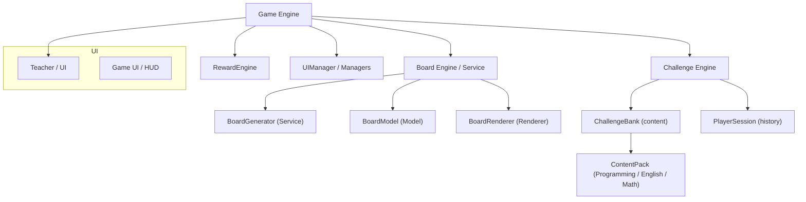

# Foundation (provisório)

Versão inicial do jogo digital de tabuleiro educativo para ensino de lógica de programação.

## Recent changes

- `GameScene`
  - `board` tornou-se opcional para evitar erros de ordem de inicialização.
  - `turnQueue` agora é inicializado antes de criar as instâncias de `PlayerPiece`, garantindo que `playerIndexByName` mapeie corretamente nomes de jogador para índices de peça.
  - Adicionado `playerIndexByName` para resolver de forma confiável o índice da peça a partir do nome do jogador.
  - Substituído o uso dinâmico de `require('../entities/PlayerPiece')` por `import PlayerPiece` estático para compatibilidade com TypeScript e melhores checagens de tipos.

Essas mudanças corrigem erros de tempo de execução e de compilação, deixando o fluxo de turnos e mapeamento de jogadores determinísticos.

  ### Mudanças aplicadas hoje (resumo)

  - `BoardRenderer`: agora utiliza a lista de chaves de tiles disponíveis (`availableTileKeys`) carregada no `BootScene` e seleciona variantes das tiles (curvas/retas/neutras) em vez de apenas placeholders estáticos. Isso melhora a variedade visual do tabuleiro.
  - `Board`: aumentei a escala do `board-background` em ~12% para acomodar tiles maiores (alvo de 240px) e reduzir risco de tiles sendo desenhadas parcialmente fora do fundo.
   - Profundidade e tiles: tiles agora são renderizados com tamanho fixo 240×240; fundo (`board-background`) fica em depth 0 e `cornerstone` em depth 20 para evitar sobreposição indesejada.
   - Scripts de assets: ferramentas para recortar/centralizar tiles e gerar versões híbridas/remasterizadas estão em `tile_gen/`.
  - Novos utilitários e assets adicionados: scripts para normalização de assets de jogador e mover `Tile.png` para `assets/tiles/tile-neutral.png`; novas imagens de tile (curvas) e `crystal.png` incluídas no repositório para testes locais.
  - Build e deploy: commit local criado e push enviado ao repositório remoto (branch `main`) após as alterações.

  Notas de QA rápida:
  - Rode o dev server (`npm --prefix Foundation run dev`) e abra `http://localhost:5173/` para verificar o background e a distribuição das tiles.
   - Se os tiles ainda parecerem errados, limpe o cache do navegador (Ctrl+F5) ou force `_ts` nos assets para busting de cache.
  - Se as variantes de tile ainda aparecerem como quadrados neutros, posso mapear explicitamente orientações e aplicar rotações para que curvas/retas mostrem corretamente.

## Filosofia do Projeto

Foundation é uma engine para jogos educacionais baseada em desafios contextuais. O tabuleiro controla apenas navegação e estados visuais. Todo o conhecimento é entregue por motores independentes (por jogador) — `ChallengeEngine`, `RewardEngine`, `Narrator` — permitindo reutilizar a mesma estrutura para diferentes disciplinas sem alterar a lógica principal.

Diagrama (visão de alto nível):



Design recommendations
- Separe responsabilidades do `Board` em `BoardGenerator`, `BoardModel` e `BoardRenderer` para facilitar trocas visuais.
- Conteúdo: `ContentPack` → `ChallengeBank` → `Challenge`. Um `ContentPack` (Programming, English, Math...) alimenta um `ChallengeBank`, que por sua vez oferece `Challenge`s ao `ChallengeEngine`.
- Adicione um `RewardEngine` separado, análogo ao `ChallengeEngine`.
- Padronize estados de tile em inglês: `UNKNOWN`, `DISCOVERED`, `AWAKENED`.
- Estenda `PlayerSession` para incluir `Inventory`, `Shield`, `Bonus`, `Penalty`, `Statistics`.
- Use um `Narrator` (ou `GuideEntity`) como a interface de narrativa; `Cornerstone` implementa a interface `Narrator` (ex.: `CornerstoneNarrator`).
- Extraia responsabilidades de `GameScene` para managers: `TurnManager`, `MovementManager`, `UIManager`.

Criei skeletons iniciais para essas peças em `Foundation/src/engine` e `Foundation/src/board` para facilitar refactors incrementais.

Nota de nomenclatura
- Padronize tipos por responsabilidade: `Engine` (coordenação), `Service` (geração/serviço), `Renderer` (visual), `Manager` (orquestração local). Ex.: `BoardEngine` -> `BoardGenerator` (Service) + `BoardRenderer` (Renderer) + `BoardModel` (Model).

- Visão resumida
- Objetivo: jogo por turnos onde os jogadores avançam em direção ao centro (a "Cornerstone") resolvendo desafios de lógica.
- Público: crianças (10+), adolescentes, iniciantes em programação e uso em sala de aula.
- Plataforma: Web local (TypeScript + Phaser 3), execução offline.

Status do repositório
- Pasta: `Foundation/` — scaffold TypeScript + Phaser + Vite.

Arquitetura importante (decisão de design)
- Tiles (casas) são apenas gatilhos e estados visuais: `oculto`, `revelado`, `desperto`.
- A responsabilidade de fornecer desafios pertence à `ChallengeEngine` (por jogador). Tiles não armazenam perguntas.
- `ChallengeBank` contém o conteúdo (perguntas) separado da lógica do tabuleiro.
- `PlayerSession` armazena histórico por jogador (perguntas respondidas, falhas, escudos, progresso).

Benefícios desta separação
- Evita que um jogador altere a experiência de outro (isolamento de desafios).
- Permite trocar totalmente o domínio de conteúdo (ex.: programação → inglês) sem tocar o tabuleiro.
- Facilita testes, persistência e futuras integrações (ex.: banco remoto de questões).

O que já está implementado (estado atual)
- Infraestrutura:
  - Projeto TypeScript com `vite` e `phaser`.
  - `index.html` e bootstrap (`src/main.ts`).
- Fluxo e UX básico:
  - `BootScene`: validação estrita de *assets críticos* (player-1..6, jewel) — bloqueia se faltarem.
  - `ConfigScene`: interface para configurar partida (2–6 jogadores, nomes, dificuldade, geração de seed).
  - `GameScene`: máquina de estados (FSM) esquelética, fila de turnos e integração com `Board`.
  - `Board`: gera trilhas e emite evento `playerEnteredTile` quando um jogador pisa numa casa.
  - `Cornerstone` + `ChallengeEngine`: nova separação onde `Cornerstone` solicita desafios ao `ChallengeEngine` por jogador.
  - `ChallengeBank` e `PlayerSession`: modelos iniciais para separar conteúdo e histórico por jogador.
  - UI do professor: botões `Aprovar` / `Reprovar` integrados ao fluxo de decisão.
  - RNG determinístico integrado via `seedrandom` (seed gerada em `ConfigScene` e propagada para o jogo).

Funcionalidades ainda pendentes (MVP / próximos entregáveis)
- Movimento animado das peças entre casas com tween e representação de peças (placeholders ou sprites reais).
- Expandir `ChallengeBank` e curadoria do conteúdo (categorias, dificuldade, versãoing de packs de perguntas).
- Recompensas e punições aplicáveis (efeitos de jogo concretos — por jogador, não por tile).
- Idempotência completa e proteção contra spam de input (debounce/locks durante animações/ações críticas).
- Telemetria local estruturada (logs por partida com seed, eventos e erros).
- Integração total da seed ao motor de jogo (usar RNG para rolagem de dados determinística reproduzível).
- Testes de robustez: spam de input, loops de partidas e falha de assets.

Diretórios e arquivos importantes
- `Foundation/src/board/Board.ts` — gera trilhas e desenha o tabuleiro placeholder; emite `playerEnteredTile`.
- `Foundation/src/scenes/BootScene.ts` — valida assets críticos no boot.
- `Foundation/src/scenes/ConfigScene.ts` — tela de configuração da partida.
- `Foundation/src/scenes/GameScene.ts` — FSM, UI do professor, integração com `seedrandom`, e orquestração de desafios via `Cornerstone` + `ChallengeEngine`.
- `Foundation/src/engine/ChallengeBank.ts` — modelo simples para conteúdo de desafios.
- `Foundation/src/engine/ChallengeEngine.ts` — API para solicitar desafios por jogador e registrar resultados.
- `Foundation/src/engine/PlayerSession.ts` — histórico por jogador.
- `assets/tools/foundation_guard.js` — script que valida que componentes do tabuleiro não contenham perguntas embutidas (útil para CI).
- `assets/tools/validate_tiles.js` — utilitário para validar assets de tile e gerar thumbs/manifest.

Como rodar localmente (desenvolvimento)

```bash
cd Foundation
npm install
npm run dev

# abrir http://localhost:5173/ no navegador
```

Como rodar testes e checagens locais

```powershell
cd Foundation
npx vitest run

# rodar o guard que impede tokens proibidos fora das engines
node assets/tools/foundation_guard.js
```

Observações para CI
- Adicione `node assets/tools/foundation_guard.js` como etapa antes do build para garantir que ninguém acople perguntas nos tiles.
- Execute `npx vitest` como etapa de teste.

Publicar no GitHub (passos recomendados)
1. Criar repositório remoto no GitHub (público). Você tem três opções:
   - Usar o GitHub CLI (`gh`) local: `gh repo create <org-or-user>/<repo-name> --public --source=Foundation --remote=origin --push`
   - Criar manualmente no GitHub web e seguir as instruções para adicionar `origin` e fazer push.
   - Fornecer um personal access token (PAT) OU me autorizar a usar `gh` (recomendado se quiser que eu execute o push). Não compartilhe o token publicamente aqui — prefira rodar o comando no seu terminal com as linhas abaixo.

2. Comandos típicos (executar no terminal na raiz do workspace):

```bash
cd Foundation
# inicializar git (se ainda não)
git init
git remote add origin https://github.com/<seu-usuario>/<repo>.git
git branch -M main
git add .
git commit -m "chore: initial Foundation scaffold"
git push -u origin main
```

Se usar `gh` (recomendado):

```bash
cd .. # na raiz do workspace
gh repo create <seu-usuario>/<repo> --public --source=Foundation --remote=origin --push
```

Checklist pré-push (recomendado)
- Verifique se `Foundation/assets/` contém os sprites críticos ou remova a validação estrita temporariamente.
- Atualize o README com imagens, licença (se aplicável) e descrição do projeto.

Próximos passos que posso executar para você
- A: Implementar movimento animado das peças entre casas e placeholders para sprites.  
- B: Ajudar a publicar o repositório remoto (posso gerar os comandos e orientá-lo; se quiser que eu execute, preciso de autorização via `gh` CLI no seu ambiente).  
- C: Configurar CI básico (por exemplo, GitHub Actions) para executar lint/build e rodar o `foundation_guard`.

Contato e colaboração
Por favor diga qual ação você deseja agora (A/B/C) ou se prefere que eu apenas gere os comandos exatos para você executar localmente para criar o repositório remoto e empurrar o código.
